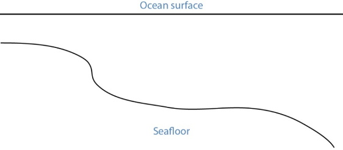
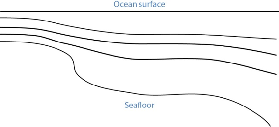
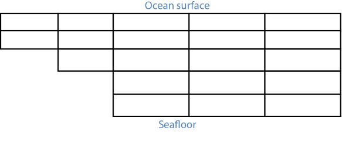

.. _noaa_formats:

NOAA specific file formats for currents
=======================================

GNOME supports a set of fjile formats specific to the the NOAA tools.

This is primarily for steady-state circulation models that produce “current patterns”, such as those produced by the NOAA CATS model.

With time-dependent models, the data can be contained in a single file or broken into smaller files. THe NOAA ASCII formats support:

Finite Element / Finite Volume - Velocities on Triangles::
  Steady State [CATS].

Finite Element / Finite Volume- Velocities on Nodes::
  Steady State or Time Dependent [ptCur]

Rectangular Grid::
  Steady State - [GridCur]

Rectangular Grid::
  Time Dependent [GridCurTime]

Current patterns can be adjusted, or “scaled,” and time dependence can be added, connecting the patterns to a time-series. Time-series used for scaling currents can be of the following types:
 * tidal currents
 * tidal height (GNOME takes the first derivative)
 * wind and hydrological flow volume

Tidal current and tidal height time-series can also be represented by the tidal harmonic series. In this case, GNOME calculates the necessary tidal information from the harmonic constants for the start time of the model run. For long simulations or Location Files, this results in using a smaller file size than the full time-series.

ASCII Formats
-------------

Currents: [CATS]
................

Finite Element – Velocities on Triangles, Steady State

For more information about file formats from the NOAA Current Analysis for Trajectory Simulation (CATS) hydrodynamic model, please see the specific documentation for that application.

Note: Current versions of GNOME include the capability to generate a Directional Acyclic Graph (DAG) Tree within GNOME, so that a portion of the current file (viz. the final section of the file, marked DAGTree) is now optional.

Example – File Name: `TinyWillapa SAC.CUR`

.. code-block:: none

    DAG 1.0
    Vertices    8
    8   8
    -124.018048 46.694592   1.000000
    -124.044816 46.668488   1.000000
    -124.017968 46.650984   1.000000
    -123.992400 46.664772   1.000000
    -123.964264 46.646212   1.000000
    -123.929744 46.673788   1.000000
    -123.956592 46.696068   1.000000
    -123.991760 46.683868   1.000000
    Topology    6
    0   1   7   5   -1  -1  0.502367    -0.298270
    1   2   3   -1  5   -1  0.000000    -0.000000
    3   4   5   -1  4   -1  0.000000    -0.000000
    5   6   7   -1  4   -1  0.588724    0.297317
    7   3   5   2   3   5   0.978753    0.205045
    7   1   3   1   4   0   0.971727    -0.100222
    DAGTree 13
    32  1   7
    31  2   5
    30  -8  3
    2   4   -8
    0   -8  -8
    7   6   -8
    6   -8  -8
    26  8   11
    25  -8  9
    12  10  -8
    13  -8  -8
    18  12  -8
    19  -8  -8

Annotated Version of the File:

.. code-block:: none

    DAG 1.0
    Vertices    8   # Number of Vertices
    8   8           # Number of Vertices, Repeated
    # Longitude   Latitude    Depth
    -124.018048 46.694592   1.000000
    -124.044816 46.668488   1.000000
    -124.017968 46.650984   1.000000
    -123.992400 46.664772   1.000000
    -123.964264 46.646212   1.000000
    -123.929744 46.673788   1.000000
    -123.956592 46.696068   1.000000
    -123.991760 46.683868   1.000000
    Topology    6    # Number of Triangles
    # Points in Tri   Adjacent Tri to Seg Velocity (u,v)  Tri number
    0   1   7   5   -1  -1  0.502367    -0.298270   0
    1   2   3   -1  5   -1  0.000000    -0.000000   1
    3   4   5   -1  4   -1  0.000000    -0.000000   2
    5   6   7   -1  4   -1  0.588724    0.297317    3
    7   3   5   2   3   5   0.978753    0.205045    4
    7   1   3   1   4   0   0.971727    -0.100222   5
    DAGTree 13  # Number of Elements in DAGTree
    # Seg No.  Branch Left  Branch Right   DAGTree Branches
    32  1   7   0
    31  2   5   1
    30  -8  3   2
    2   4   -8  3
    0   -8  -8  4
    7   6   -8  5
    6   -8  -8  6
    26  8   11  7
    25  -8  9   8
    12  10  -8  9
    13  -8  -8  10
    18  12  -8  11
    19  -8  -8  12

Currents: [ptCur]
.................

Finite Element – Velocities on Nodes

Most finite element circulation models calculate velocities on the triangular grid nodes.
The ptCur format can be used to make a single time-step “current pattern” or include the full model run time-series.
The format can be divided into several portions: header block, point definition block, topology, and time-specific data blocks.

The header block provides basic information about the file, and much of the information is optional.

The point definition block includes all the points, organized with the boundary points first.

The topology block defines the triangular topology and segment list, and the DAGtree defines how to search through the triangles quickly. (These blocks are optional, as GNOME can calculate all this information; although loading the file will take longer without it.)

The time-specific data blocks make up the velocity data.

Note:: There are two different forms of the ptCur data format. The first has velocity values at all of the points, including the boundaries. In the second case, the original circulation model does not specifically define the boundary points, and defining these points may be too time-consuming for the user. In this second case, fake boundary points may be defined that have zero velocity at these nodes. A keyword in the VERTICES line notifies GNOME that the first NumLandPts have zero velocities, and these points do not show up in the velocity data (i.e., the velocity data start with point NumLandPts+1).

.. rubric:: The Header Block

The header block is made up of lines that are initiated with a reserve word, which is enclosed in square brackets and is all caps, followed by a tab and the corresponding value. Each of these lines provides some global information about the file, and all but the first two are optional. The other lines have default values that GNOME provides. Except for the first line, the order of header lines is not important; however, if the keyword is in the file, a value must follow it, even if it matches the default value. Table 2 lists the supported header lines.

.. rubric:: Table 2. Lines supported in the header block.

===============  ======================  ===========  ===========
 Reserve Word     Definition              Data Type    Necessity
===============  ======================  ===========  ===========
 [FILETYPE]      “PTCUR”                  text         required
 [NAME]          “user name for file”     text         optional
 [CURSCALE]      multiplicative_scale     float        optional
 [UNCERTALONG]   along_axis               float        optional
 [UNCERTCROSS]   cross_axis               float        optional
 [UNCERTMIN]     min_current_resolution   float        optional
 [GRIDTYPE]      vertical model used,
                 bottom bc                text         optional
 [MAXNUMDEPTHS]  max depth values         int          optional
 [USERDATA]      “non GNOME user info”    text         optional
===============  ======================  ===========  ===========

``[FILETYPE]`` is an identifier for GNOME that identifies the following data as a PTCUR file. This is a mandatory first line for all PTCUR files.

``[NAME]`` is used to identify the type of file for GNOME and allows the user to supply a name for the resulting current mover that will appear in the GNOME Summary List, in the left section of the window.

``[CURSCALE]`` is used to set a global multiplicative scale for all of the current data in the file. In general, GNOME assumes that all of the current data it receives are in units of m s-1, but the PTCUR mover will allow for a change of units through this global scaling term. If this term is not provided in the file, a value of 1.0 will be assumed. In GNOME’s Diagnostic Mode, the associated dialog box allows the user to set or override this value.

``[UNCERTALONG]`` and ``[UNCERTCROSS]`` are terms whereby the user can specify a pair of coefficients that GNOME will use to set the uncertainty associated with the PTCUR mover. The first coefficient will set the bound on the Monte Carol uncertainty components added/subtracted to the along-axis component of the current vector, and the second coefficient will be used to Monte Carol the cross-axis uncertainty of the current vectors. If this term is not provided in the file, values of 0.5 and 0.25 will be assumed. In GNOME’s Diagnostic Mode, the associated dialog box allows the user to override these values.

``[UNCERTMIN]`` is currently not implemented, and a value of 0.0 is assumed. When implemented, the Uncertainty Minimum is intended to be used to set a minimum speed resolution that is expected from the model, and is used to Monte Carol an uncertainty for cases where the predicted currents are very small. If this term is not provided in the file, a value of 0.05 will be assumed. In GNOME’s Diagnostic Mode, the associated dialog box allows the user to override these values.

``[GRIDTYPE]`` is an identifier of how the vertical depth data were modeled. If there are no depth data, the keyword “2D” is used. If there is information about the depth of the area being modeled, but the currents are the same at every depth, the keyword “BAROTROPIC” is used (see Figure 1, below). If the depth is modeled using a sigma coordinate model, the keyword “SIGMA” is used (see Figure 2). If the depth is modeled using a layered system, the keyword “MULTILAYER” is used (see Figure 3). These last two options also require a boundary keyword, either “NOSLIP” or “FREESLIP”, where “NOSLIP” also requires a distance in meters to define the boundary layer. This distance is constant throughout the domain. The default is “2D”, in which case any depth information will be ignored.

   Barotropic model – single velocity top to bottom.

   Sigma model – uniform number of layers, thickness scales to total depth.

   Gridded model – number of layers and layer thickness may vary from place to place.

``[MAXNUMDEPTHS]`` gives the maximum number of depth points where horizontal currents are available. In some cases, points within the model may have fewer defined depth points than this number. The sigma model, however, must have data for MAXNUMDEPTHS in the water column at every horizontal point. The layered model has data at a maximum of MAXNUMDEPTHS in the water column for any horizontal point. The default is 1, which corresponds to surface data only and is the case for both the 2-D and barotropic grid types. (Though the latter has depth, it only has one unique current value per horizontal point.)

.. rubric:: The Point Definition Block

The ``POINT DEFINITION BLOCK`` describes the area covered by the model, including all of the horizontal points where data are available and at which depths the information is specified.
This part of the model description also completely defines the topological characteristics of the model domain by specifying the boundary segments that divide the region into “inside” and “outside” portions.

The first line in the ``POINT DEFINITION BLOCK`` is made up of the keyword “Vertices”, followed by the total number of horizontal points and the number of land points, separated by white space.

``[USERDATA]`` is a reserved word that can be used (repeatedly, if necessary) by the developer of the PTCUR data to record any type of text documentation or metadata that they want to keep associated with the file. This is optional and can be thought of as a comment area in the file format.

.. code-block:: none

  Vertices        NPTs     NumLandPts

The fields are defined as follows:

``NPTs``
  Gives the total number of horizontal data points (boundary and inside vertices).

``NumLandPts``
  If data are available at all the horizontal points, this is zero. If there is a separate outer boundary from a land map where current data are not available (assumed to be zero there), the number of these boundary points is given.

The next NPTs lines of the POINT DEFINITION BLOCK define the individual horizontal points where data are available.
Each line describes a single data point with the following fields, separated by white space.

.. code-block:: none

  Pt# Longitude   Latitude    depth d1 d2 ... dNdepths

Each of the fields is defined as follows:

Pt#
  A sequence number, or line number, assigned to each point 1…NPts.

Longitude
  The latitude of the point, given in decimal degrees ranging from -180 to 180. The Western hemisphere is by convention negative latitude.

Latitude
  The longitude of the point, given in decimal degrees ranging from -90 to 90.
  The Northern hemisphere is by convention positive longitude.

depth
  The depth in meters of the modeled ocean at the point. If the grid-type is 2-D, this field and the rest of the line will not be read.

d1 d2 … dNdepths
  Each of the d1 through dNdepths values will be interpreted as a depth within the water column where current information will be defined.
  If the grid-type is barotropic, these points will not be read and the currents that are given will be assumed to represent the entire water column.
  For any point where data are available at fewer than the maximum number of depths, the user should enter, in order, all the valid depths and end the line with -1 to mark the end of data.

The lines that represent data points have two restrictions on the order in which they are entered into the file:

 1.  All boundary segments must be at the beginning of the file

 2.  All boundary segments must have their points entered sequentially in “counter-clockwise” (CC) order.

   a.  CC order is defined as follows: If an observer were to travel along the boundary of the model in a direction such that his/her left hand always pointed to the inside of the model, then they would encounter the boundary points in CC order.

   b.  To build a PTCUR file, the user would first enter all of the points in CC order around the outer boundary of the model and follow those by the points in CC order around all the islands (in this case, only one). After the boundary segments are entered in the point list, all other points (the interior ones) can be entered in any order that is convenient.

After a line is entered for each of the model’s horizontal data points, the next line contains a single integer value:

.. code-block:: none

  Number_of_Boundary_Segments

This is the total number of boundary segments that are needed to define the inside/outside of the model. The first boundary listed is the main outer edge of the model;
then each of the islands represented by the model is added. For example, a domain with no islands will have a value of “1”, while a domain with two islands will have a value of “3”.

Following the line that tells GNOME how many boundary segments there are in the model domain will be one line for each of the boundary segments, with the number of the last boundary point on the corresponding segment.

.. code-block:: none

    Last_point_in_segment1
    Last_point_in_segment2
    ...

You may want to define the land/water map from the vertices of your domain. This may be preferable to using a high resolution shoreline if your model and the shoreline have significant mismatch. In order to define the map, you need to specify if any of the segments are open water.

.. code-block:: none

    WaterBoundaries 2   5
    3
    4

The numbers in the header line are the number of water boundaries and the total number of boundaries. The listed points are the indices of the end-points of the water boundary segments.

.. rubric:: The Topology Block – Optional

From the POINT DEFINITION BLOCK, GNOME will be able to completely reconstruct the topology and geometry of the model domain and develop an interpolation procedure to estimate data between the specified data points. GNOME will also be able to calculate when a pollutant particle has encountered a boundary of the model domain.

Alternatively, the CATS program can be used to determine the topology. The POINT DEFINITION BLOCK is in similar form to a vertex data (VerDat) file and can easily be transformed to one. To do this:

 1. create a separate file with a header line “DOGS”,

 2. then all the points, comma delimited, followed by a line of zeros, and

 3. finally the boundary information.

 Any depth information should be removed and a single z value included for each point (≥1.0). The order of the points in the PTCUR file must be the same as those in the VerDat file used in CATS. You can then create a fake current pattern, and export the .CUR file. Select the Topology and DAGtree blocks from a CATS .CUR file and paste them into your PTCUR file. (The DAGtree is optional. If GNOME doesn’t find a DAGtree, it will create it from the topology.) Then GNOME won’t have to perform triangularization, which saves time if the same topology will be used repeatedly with different data sets. GNOME will ignore the velocity information given at the end of each topology line from the CATS .CUR file. For more information on using CATS to transform a POINT DEFINITION BLOCK to a VerDat file, see the CATS-specific documentation.

.. rubric:: The Time-Specific Data Blocks

The TIME SPECIFIC DATA BLOCK contains the actual current velocity data for a fixed current pattern.
If the input data represent a time-stepping pattern, then the block will be repeated as many times as necessary to step through the input information.

The first line in the TIME SPECIFIC DATA BLOCK is the keyword [TIME], followed by the time at which the block of current data was taken.

.. code-block:: none

  [TIME]  StartDay StartMo StartYr StartHr StartMin

The last five fields on this line define the time when the data in the following data block were taken.
If these fields have the default value “-1” in them, it will indicate that the model data represent a steady state and that only one TIME SPECIFIC DATA BLOCK will be present.

The next NPTs lines of data in the POINT DEFINITION BLOCK give the current data for each of the points described in the POINT DEFINITION BLOCK. The line of data contains:

.. code-block:: none

  Pt# Ud1 Vd1 Ud2 Vd2 … UdNdepths VdNdepths

The number of U-V pairs that are given on each line will need to correspond to the data given in the POINT DEFINITION BLOCK.
For example, if four different depth data points are specified for a particular point, then four U-V pairs will be expected.
This means that different lines of data may be of different lengths, but they will all end with a return sequence, and the actual number of fields for a particular point will be given by the line defining that point in the POINT DEFINITION BLOCK.

If the TIME SPECIFIC DATA BLOCK does not start with a constant time flag, then it may be followed by another TIME SPECIFIC DATA BLOCK, which is in the same format, but will have a different time.
Each succeeding time block must have a time value that is larger than the one from the previous block.
The offsets can vary in size, though.

For very large data sets, where having all the currents in one file would be unwieldy (for example, small time-steps or extended time runs, as in Trajectory Analysis Planner [TAP]), there is an alternative format. The [TIME] blocks can be put in separate files, with any number of blocks in each file. In place of these blocks in the header file, the full file path names (or partial paths, relative to the GNOME folder), and the start-time and end-time contained in each file should be listed. The keywords for this are [FILE], [STARTTIME], and [ENDTIME]. If there is a single time in a file, the start-time and end-time are the same. A constant current can also be done this way; start-time and end-time are both a series of negative ones (“-1”).

Three annotated example files follow. At this time, only 2-D time-dependent (x,y,t) data are shown in the examples.

Example 1 – Filename: skipptcur.cur
...................................

.. code-block:: none

    [FILETYPE]  PTCUR
    [NAME]  skip_ps_ptcur2D
    [CURSCALE]  2.0
    [UNCERTALONG]   .3052
    [UNCERTCROSS]   .127
    [UNCERTMIN] .01
    [MAXNUMDEPTHS]  1
    [GRIDTYPE]  2-D
    [USERDATA]  hi fred
    [USERDATA]how are you ?
    VERTICES    5056    3150
    1   -122.548000 47.588500   1.000
    2   -122.547000 47.585500   1.000
    3   -122.548000 47.581300   1.000
    4   -122.547000 47.578700   1.000
    5   -122.543000 47.578200   1.000
    6   -122.544000 47.576000   1.000
    7   -122.546000 47.574000   1.000
    8   -122.549000 47.572400   1.000
    9   -122.550000 47.570600   1.000
    10  -122.545000 47.568500   1.000
    . . .
    . . .
    5054    -122.447000 47.582600   1.000
    5055    -122.437000 47.583300   1.000
    5056    -122.427000 47.583600   1.000
    Topology    6986
    4   5045    5046    4162    2612    2613    -2.536220   3.269671
    2   3   4   -1  2   -1  0.662334    0.724430
    4   1   2   -1  1   2612    1.187206    0.244548
    5   10  5045    8   2613    7   -0.668295   1.037525
    6   9   10  -1  7   6   -0.174680   -0.246778
    7   8   9   -1  6   -1  -0.130291   -0.090753
    . . .
    . . .
    4958    4942    4959    6981    6975    6960    -0.899112   5.741174
    4442    4441    4419    6922    6966    6985    0.818613    0.580789
    4420    4421    4442    6969    6966    6967    0.626956    0.418461
    4442    4461    4441    6980    6983    6970    0.641757    0.720018
    DAGTree 15270
    34236   1   7758
    10448   2   3922
    32803   3   1906
    23762   4   1005
    13772   5   492
    34118   6   260
    . . .
    . . .
    2448    -8  -8
    2455    15268   15269
    2454    -8  -8
    2466    -8  -8
    [TIME]  14 2 00 10 00       Day Month Year Hour Minute
    0.889853    0.737729
    2.14009 1.90379
    2.84519 2.40390
    2.84138 2.89028
    2.33662 3.00912
    0.0381742   1.07280
    1.23144 2.63017
    1.02648 2.13573
    . . .
    -1.96154    9.09004
    1.30358 -7.58093
    0.697695    -6.05114
    [TIME]  14 2 00 11 00      # Day Month Year Hour Minute
    0.605738    0.502185
    1.38961 1.23618
    0.982804    0.830371
    -0.529060   -0.538164
    -1.72646    -2.22335
    0.403527    -0.554565
    -1.38999    -2.69251
    . . .
    2.66105 -11.2783
    -0.714619   3.31164
    2.13874 -12.4378
    -0.351095   3.04506  #Velocity information ends the file

Example 2 – Filename:  ptCurMap.cur
...................................

.. code-block:: none

    [FILETYPE]  PTCUR
    [NAME]  PtCur : Negative currents
    [CURSCALE]  2.0
    [UNCERTALONG]   .3052
    [UNCERTCROSS]   .127
    [UNCERTMIN] .01
    [MAXNUMDEPTHS]  1
    [GRIDTYPE]  2-D
    [USERDATA]  comments here
    [USERDATA]
    Vertices    9   0
    1   -124.360000 48.574744   1.000000
    2   -124.959368 48.563896   1.000000
    3   -125.104952 48.182896   1.000000
    4   -124.534720 48.210148   1.000000
    5   -124.360000 48.288996   1.000000
    6   -124.702840 48.452732   97.000000
    7   -124.863320 48.383372   60.000000
    8   -124.739872 48.299656   102.000000
    9   -124.545448 48.400108   75.000000
    BoundarySegments    1
    5
    WaterBoundaries 2   5   (optional section to generate land water map)
    3
    4
    [TIME]  14 2 00 10 00
    0.041327    0.001107
    0.079485    -0.004495
    0.036132    0.002556
    0.053070    0.035451
    0.086580    0.005730
    0.045369    0.012076
    0.031629    -0.002985
    0.039163    0.009258
    0.023545    -0.000079
    [TIME]  14 2 00 11 00
    0.041327    0.001107
    0.079485    -0.004495
    0.036132    0.002556
    0.053070    0.035451
    0.086580    0.005730
    0.045369    0.012076
    0.031629    -0.002985
    0.039163    0.009258
    0.023545    -0.000079
    [TIME]  14 2 00 12 00
    0.041327    0.001107
    0.079485    -0.004495
    0.036132    0.002556
    0.053070    0.035451
    0.086580    0.005730
    0.045369    0.012076
    0.031629    -0.002985
    0.039163    0.009258
    0.023545    -0.000079
    [TIME]  14 2 00 13 00
    0.041327    0.001107
    0.079485    -0.004495
    0.036132    0.002556
    0.053070    0.035451
    0.086580    0.005730
    0.045369    0.012076
    0.031629    -0.002985
    0.039163    0.009258
    0.023545    -0.000079
    [TIME]  14 2 00 14 00
    0.041327    0.001107
    0.079485    -0.004495
    0.036132    0.002556
    0.053070    0.035451
    0.086580    0.005730
    0.045369    0.012076
    0.031629    -0.002985
    0.039163    0.009258
    0.023545    -0.000079
    [TIME]  14 2 00 15 00
    0.041327    0.001107
    .079485 -0.004495
    0.036132    0.002556
    0.053070    0.035451
    0.086580    0.005730
    0.045369    0.012076
    0.031629    -0.002985
    0.039163    0.009258
    0.023545    -0.000079
    [TIME]  14 2 00 16 00
    0.041327    0.001107
    0.079485    -0.004495
    0.036132    0.002556
    0.053070    0.035451
    0.086580    0.005730
    0.045369    0.012076
    0.031629    -0.002985
    0.039163    0.009258
    0.023545    -0.000079
    [TIME]  14 2 00 17 00
    0.041327    0.001107
    0.079485    -0.004495
    0.036132    0.002556
    0.053070    0.035451
    0.086580    0.005730
    0.045369    0.012076
    0.031629    -0.002985
    0.023545    -0.000079
    0.027216    0.003247

Example 3 – Filename:  ptCurNoMap.cur
.....................................

.. code-block:: none

    [FILETYPE]  PTCUR
    [NAME]  PtCur : Negative currents
    [CURSCALE]  2.0
    [UNCERTALONG]   .3052
    [UNCERTCROSS]   .127
    [UNCERTMIN] .01
    [MAXNUMDEPTHS]  1
    [GRIDTYPE]  2-D
    [USERDATA]  comments here
    Vertices    9   0
    1   -124.360000 48.574744   1.000000
    2   -124.959368 48.563896   1.000000
    3   -125.104952 48.182896   1.000000
    4   -124.534720 48.210148   1.000000
    5   -124.360000 48.288996   1.000000
    6   -124.702840 48.452732   97.000000
    7   -124.863320 48.383372   60.000000
    8   -124.739872 48.299656   102.000000
    9   -124.545448 48.400108   75.000000
    BoundarySegments    1
    5   (Note that the Water Boundaries section is missing)
    [TIME]  14  2 00 10 00
    0.041327    0.001107
    0.079485    -0.004495
    0.036132    0.002556
    0.053070    0.035451
    0.086580    0.005730
    0.045369    0.012076
    0.031629    -0.002985
    0.039163    0.009258
    0.023545    -0.000079
    [TIME]  14 2 00 11 00
    0.041327    0.001107
    0.079485    -0.004495
    0.036132    0.002556
    0.053070    0.035451
    0.086580    0.005730
    0.045369    0.012076
    0.031629    -0.002985
    0.039163    0.009258
    0.023545    -0.000079
    [TIME]  14 2 00 12 00
    0.041327    0.001107
    0.079485    -0.004495
    0.036132    0.002556
    0.053070    0.035451
    0.086580    0.005730
    0.045369    0.012076
    0.031629    -0.002985
    0.039163    0.009258
    0.023545    -0.000079
    [TIME]  14 2 00 13 00
    0.041327    0.001107
    0.079485    -0.004495
    0.036132    0.002556
    0.053070    0.035451
    0.086580    0.005730
    0.045369    0.012076
    0.031629    -0.002985
    0.039163    0.009258
    0.023545    -0.000079
    [TIME]  14 2 00 14 00
    0.041327    0.001107
    0.079485    -0.004495
    0.036132    0.002556
    0.053070    0.035451
    0.086580    0.005730
    0.045369    0.012076
    0.031629    -0.002985
    0.039163    0.009258
    .023545 -0.000079
    [TIME]  14 2 00 15 00
    0.041327    0.001107
    0.079485    -0.004495
    0.036132    0.002556
    0.053070    0.035451
    0.086580    0.005730
    0.045369    0.012076
    0.031629    -0.002985
    0.039163    0.009258
    0.023545    -0.000079
    [TIME]  14 2 00 16 00
    0.041327    0.001107
    0.079485    -0.004495
    0.036132    0.002556
    0.053070    0.035451
    0.086580    0.005730
    0.045369    0.012076
    0.031629    -0.002985
    0.039163    0.009258
    0.023545    -0.000079
    [TIME]  14 2 00 17 00
    0.041327    0.001107
    0.079485    -0.004495
    0.036132    0.002556
    0.053070    0.035451
    0.086580    0.005730
    0.045369    0.012076
    0.031629    -0.002985
    0.023545    -0.000079
    0.027216    0.003247

Currents: Rectangular Grid – Steady State [GridCur]
---------------------------------------------------

The GridCur file should contain velocity information in the x and y directions on a rectangular grid. The first eight lines contain header information that defines the file type, grid size, and grid location. The remaining lines contain the current data. The keywords are the words shown in capital letters below. They must appear exactly as shown. This documentation consists of two example files followed by an explanation of each of the file components. You can set the range of the data by providing:

 a. the upper left corner position and the increment size of Δ_x and Δ_y, or
 b. the bounding latitude and longitude box.

If you would like to try either of these current patterns, you will also need the GridCur.bna file.

Note: If you have missing values, you may simply skip those grid points in the data file.

.. rubric:: Example 1 – Filename: GridCurExA.cur

In this first example, GridCurExA.cur, position information is given from a starting latitude and longitude and an increment.

.. code-block:: none

    [GRIDCUR]
    NUMROWS 100
    NUMCOLS 100
    STARTLAT 33.8
    STARTLONG -120.4
    DLAT .008
    DLONG .01
    row col u v
    1 1 .10 .10
    1 2 .10 .10
    1 3 .10 .10
    1 4 .10 .10
    1 5 .10 .10
    1 6 .10 .10
    . . .

.. rubric:: Example 2 – Filename: GridCurExB.cur

In this second example, GridCurExB.cur, the grid location is given by bounding latitudes and longitudes.

.. code-block:: none

    [GRIDCUR]
    NUMROWS 100
    NUMCOLS 100
    LOLAT 33.4
    HILAT 35
    LOLONG -120.4
    HILONG  -119
    row col u v
    1 1 .10 .10
    1 2 .10 .10
    1 3 .10 .10
    1 4 .10 .10
    1 5 .10 .10
    . . .

Explanation of File Components:

The first line of the file is a flag identifying the file as an outside current file:

.. code-block:: none

    NUMROWS nrows
    NUMCOLS ncols

Lines 4 through 7 give the grid bounds and can be specified in either of two ways:

1. By the latitude and longitude of the grid origin (assumed to be the upper-left corner) and the increment size:

.. code-block:: none

    STARTLAT    lat
    STARTLON    long
    DLAT    dlat
    DLONG   dlong

 2. By low and high latitude and longitude ranges:

.. code-block:: none

    LOLAT   lolat
    HILAT   hilat
    LOLONG  lolong
    HILON   hilong

In the former case, the velocities are assumed to be given at the grid points, and in the latter case, the velocities are assumed to be in the center of grid rectangles.

Line 8 is designed to be a header, identifying the columns of data. It is read, but not used.

.. code-block:: none

  row col u   v

This header information is followed by NROWS × NCOLS lines of current data. Each line consists of 4 elements, corresponding to the items in Line 8. These are the point’s location in the grid, given by a row and column, and its velocity components in the x and y directions, assumed to be in m s-1. The file must contain a line for each of the NROWS × NCOLS grid points.

Currents: Rectangular Grid – Time Dependent [GridCurTime]
---------------------------------------------------------

If you have a rectangular grid time-dependent model, you can use this data format to create the time-series of currents for GNOME. Large models and/or long time-series can produce large files of output fields. You have the option to store all your data in one file, or in a series of files. We have been successful in obtaining daily forecasts in separate files, archiving them, and then “stringing” them together to create a time-series for a single incident.

Data in a Single File
.....................

GNOME accepts rectangular grid models in a simple file format, similar to the single current pattern described above.
The header now indicates with [GRIDCURTIME] that time has been added, and the time of the first time-step has been given in the [TIME] line.

.. note:: As in the rectangular GridCur data format, if you have missing values, you may simply skip those grid points in the data file. You may also create a constant current pattern by setting all the time references to -1.

.. rubric:: Example – Filename: gridcurTime.cur

.. code-block:: none

    [GRIDCURTIME]
    NUMROWS 100
    NUMCOLS 100
    LOLAT 34.0
    HILAT 34.4
    LOLONG -120.8
    HILONG  -119.2
    [TIME]  14  2 00  10 00 # day  month  year  hour  minute
    1 1 .10 .10
    1 2 .10 .10
    1 3 .10 .10
    1 4 .10 .10
    …

Each succeeding time-step is simply appended onto the bottom:

.. code-block:: none

    100 97 .10 .10
    100 98 .10 .10
    100 99 .10 .10
    100 100 .10 .10
    [TIME]  14  2 00  11 00 # next timestep information
    1 1 .20 .20
    1 2 .20 .20
    1 3 .20 .20
    1 4 .20 .20
    1 5 .20 .20
    1 6 .20 .20

.. rubric:: Data in Multiple Files

With larger time-series of current data, it may be useful to break the current time-series into separate files that make up a long time-series all together.
In that case, GNOME supports multi-file data with a header file that indicates data and hard drive location information, and the subsequent files.
The format is similar to the header on the regular GridCurTime format; however, rather than including the time information and the data, this header includes the file name and location, and the start and end times for each of the files. GNOME uses linear interpolation between time-steps within and across files. The references to the locations of the different current files on the computer’s hard drive can be given two ways: a full path description of the directory or a relative description of the directory.

.. note:: A constant current can be created using a single record with all the time indicators set to -1. A single time-step is acceptable in a file with the start and end times listed as the same time in the header file.

The following four files are provided as examples with full path descriptions:

``gridcurtime_hdr.cur``

``gridcurtime_hdrA.cur``

``gridcurtime_hdrB.cur``

``gridcurtime_hdrC.cur``

